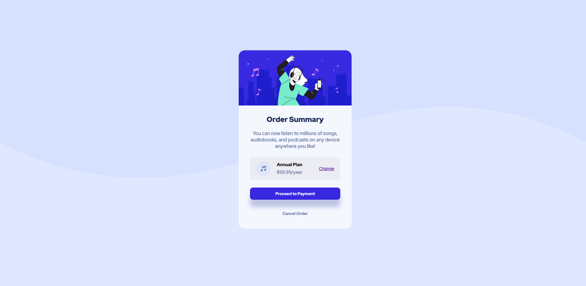
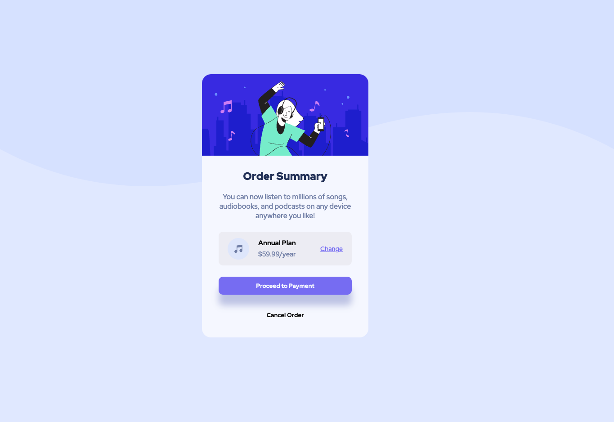
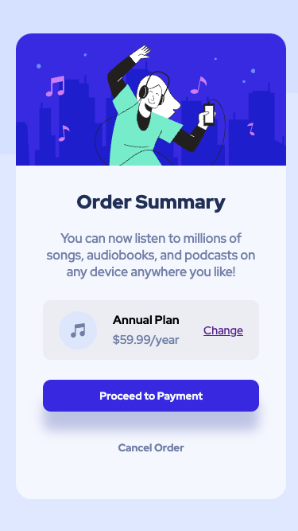

# Frontend Mentor - Order summary card solution

This is a solution to the [Order summary card challenge on Frontend Mentor](https://www.frontendmentor.io/challenges/order-summary-component-QlPmajDUj). Frontend Mentor challenges help you improve your coding skills by building realistic projects. 

## Table of contents

- [Overview](#overview)
  - [The challenge](#the-challenge)
  - [Screenshot](#screenshot)
  - [Links](#links)
- [My process](#my-process)
  - [Built with](#built-with)
  - [What I learned](#what-i-learned)
  - [Continued development](#continued-development)
- [Author](#author)

## Overview

### The challenge

Users should be able to:

- See hover states for interactive elements

### Screenshot
- Desktop view


- Active status


- Mobile view


### Links

- Solution URL: [GitHub](https://github.com/EshrakRahman/Order-summary-component)
- Live Site URL: [GitHub page](https://eshrakrahman.github.io/Order-summary-component/)

## My process

### Built with

- Semantic HTML5 markup
- CSS custom properties
- Flexbox
- Desktop-first workflow


### What I learned

During my journey with **Frontend Mentor**, I delved deep into several foundational CSS concepts, enhancing both my understanding and practical skills.

#### Flexbox:
This powerful layout model allowed me to craft complex layout structures with a more efficient and predictable way than traditional models. I grasped properties like `justify-content`, `align-items`, and `flex-direction`. Flex containers simplified intricate layouts, making the design more responsive and the code neater.

#### Positioning:
I refined my grasp on the `position` property, learning to control element placement. By experimenting with values like `relative`, `absolute`, `fixed`, and `sticky`, I could achieve layouts with pinpoint accuracy.

In conclusion, this challenge enriched my technical skill set, elevating my confidence in crafting responsive and aesthetic web designs.


To see how you can add code snippets, see below:

```html
<div class="plan">
  <div class="annual-plans">
    
    <div class="wrapper">
      <p>Annual Plan</p>
      <p>$59.99/year</p>
    </div>
  </div>
  <p class="change-option">
    <a href="#">Change</a>
  </p>
</div>
```
```css
.order-info .description {
  font-size: var(--paragraph-font-size);
  width: 100%;
  text-align: center;
  color: var(--neutral-desaturated-blue);
  font-weight: 500;
  margin-bottom: 25px;
}

.plan {
  width: 100%;
  height: 75px;
  border-radius: 10px;
  padding: 20px;
  margin-bottom: 25px;
  background-color: rgba(234, 234, 241, 0.82);
  display: flex;
  justify-content: space-between;
  align-items: center;
  border: none;

}
```

### Continued development

In forthcoming projects, I aim to delve deeper into **responsive design** methodologies, ensuring consistent user experiences across all devices. **Flexbox** and **Grid** layouts, though familiar, still pose intricate challenges that I wish to master. I've found **JavaScript animations** intriguing and plan to integrate them more seamlessly into my designs. Additionally, **accessibility** remains a crucial focus. I recognize the importance of inclusive web design, and I'm determined to learn techniques that cater to all user needs. Lastly, I intend to explore **performance optimization**, ensuring that the websites I build are not just visually appealing but also efficient. Each project presents a learning curve, and I'm enthusiastic about climbing higher on every turn.

## Author

- Website - [GitHub](https://www.github.com/eshrakrahman)
- Frontend Mentor - [@eshrakrahman](https://www.frontendmentor.io/profile/eshrakrahman)

